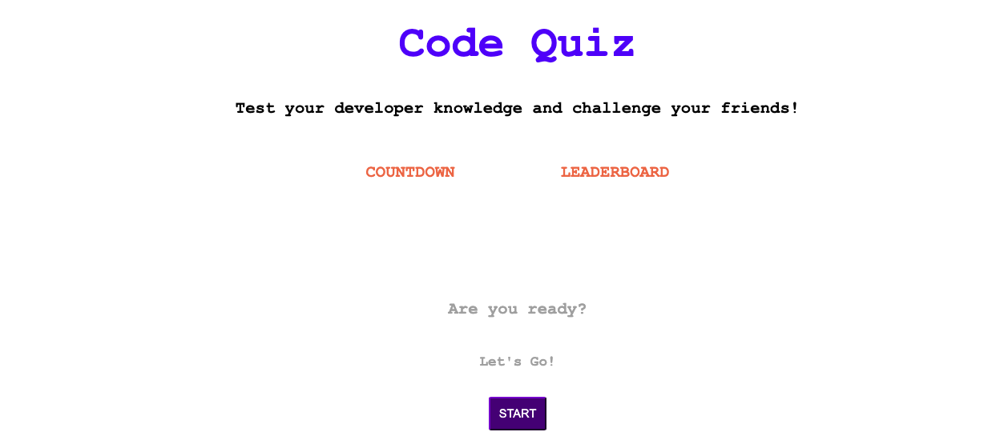
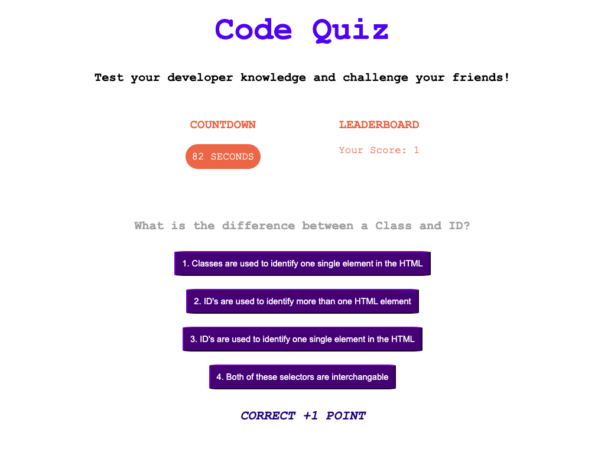
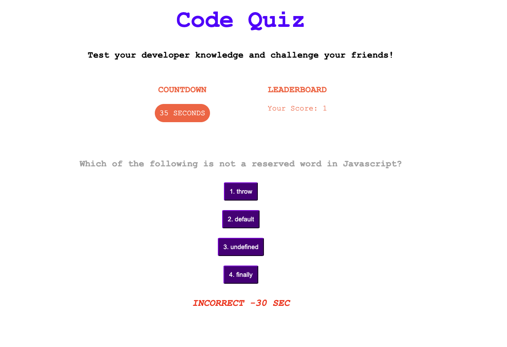
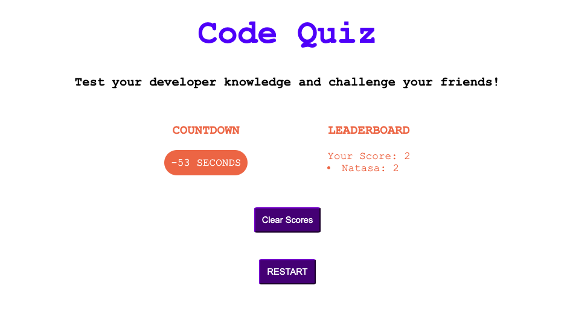

# Code Quiz

Timed coding quiz app with multiple-choice questions

## Deployment Link

https://natasa00.github.io/CodeQuiz/

## Technologies used for this project

- JavaScript
- CSS
- HTML

## Description

When user clicks the start button, the timer starts and the question show in the app. When one question is answered, the next question appears. When question is incorrectly answered, time is subtracted from the clock. When timer reaches 0, it is the end of the game. When game is over, user can add name to the Leader Board to view the scores later.

